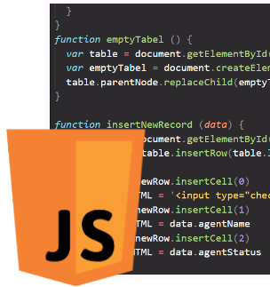

# JS image manipulator ![badge]



JS lib a like app, which manipulates images (width and rotate). Two ways of doing so, there for two solutions.
Changes are applied as inline style.

[badge]: https://img.shields.io/badge/status-stable-green.svg

### Project completed

All features implemented and working.


### Features

1. Change width
2. Rotate image
3. Reset applied style

### About versions

- Version2
  Less complex but repetitive code, many functions.
- Version1
  More complex, everything is inside one big function. Switch case.
  Function call done with an object as parameter.

### What I learned

- Object as parameter
- Functions bundled inside object
- Working with switch case
- Instead of using variable, function's return can be used:

```js
for ( var i = 0; i < selector(id).length; i++) {
      selector(id)[i].style.width = newWidth
//vs
var element = document.querySelectorAll(id)
    for ( var i = 0; i < element.length; i++) {
      element[i].style.width = newWidth
    }
```
